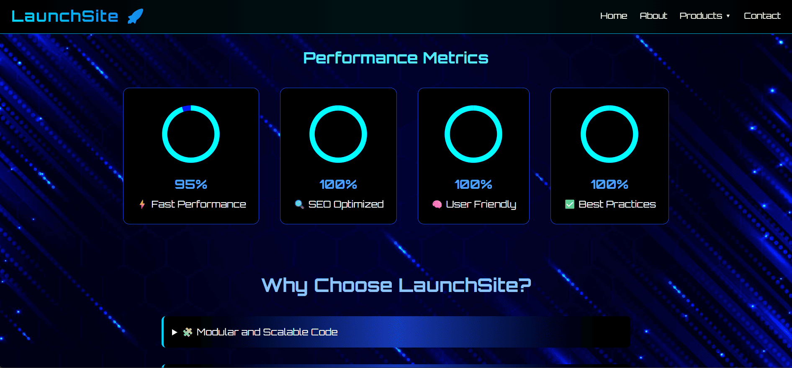
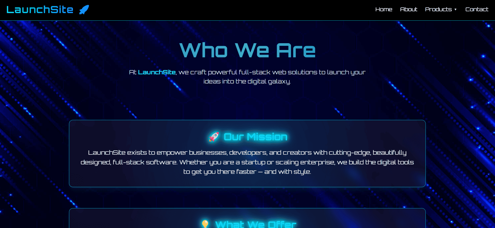
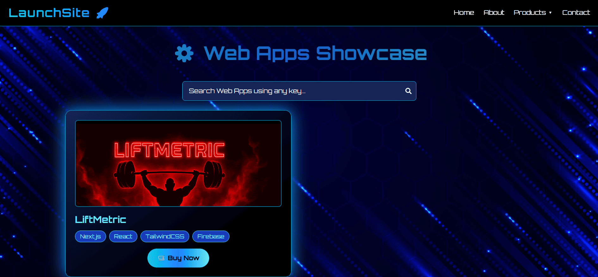
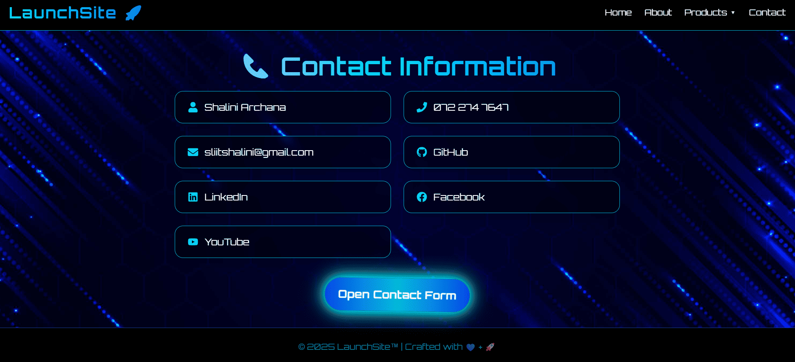

##🚀 LaunchSite – Premium Full-Stack Software Marketplace

Welcome to **LaunchSite**, your ultimate platform to **sell and showcase** custom-built software products — including websites, mobile apps, and system software. Whether you're a startup, entrepreneur, or tech enthusiast, LaunchSite helps buyers discover high-performance, beautifully crafted solutions 🧠💻📲.

## ✨ Features

- 💼 **Sell Custom Software** – Websites, apps, tools, systems.
- 🖼️ **Modern Product Showcases** – Image sliders, animated cards.
- 📨 **Easy Contact & Inquiry** – Get client messages directly.
- 🌗 **Dark-First UI Design** – Futuristic & responsive.
- 🎯 **Optimized for Speed, SEO & UI Animation**

## ⚙️ Built With

  
  
  
  
  
  
  
  

## 🖼️ Product Previews

  
  

  
  

## 🛒 Who Is It For?

- 🔹 Developers who want to **sell** projects directly.
- 🔹 Businesses looking for **ready-to-use solutions**.
- 🔹 Entrepreneurs launching **SaaS & web apps**.
- 🔹 Agencies or freelancers showcasing a **portfolio**.

## 🚧 Live Demo

👉 **Coming Soon** – Deployed version on [Vercel](https://vercel.com/) or [GitHub Pages].

## 📬 Contact

Feel free to connect or hire via the contact form or:

## 🌐 Website
[LaunchSite](https://launch-site-tan.vercel.app/)

## 📧 Email
[sliitshalini@gmail.com](mailto:sliitshalini@gmail.com)

## 🔗 LinkedIn
[Shalini Archana](https://www.linkedin.com/in/shalini-archana-vidanaarachchi-417a08314/)

## 💻 GitHub
[@your-username](https://github.com/shaliniarchana)

## 🤝 Contributing

Contributions and ideas are always welcome. Fork it, improve it, and open a PR 🚀

##🧠 License
Licensed under the MIT License

